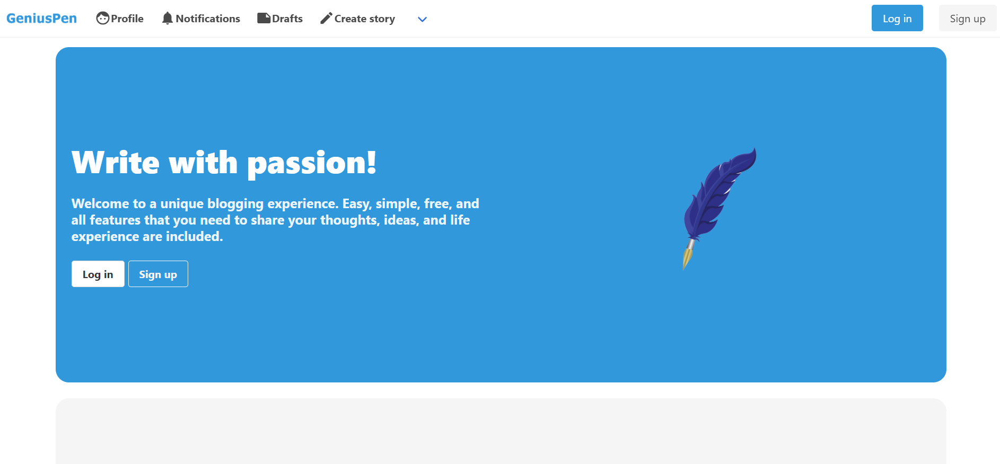
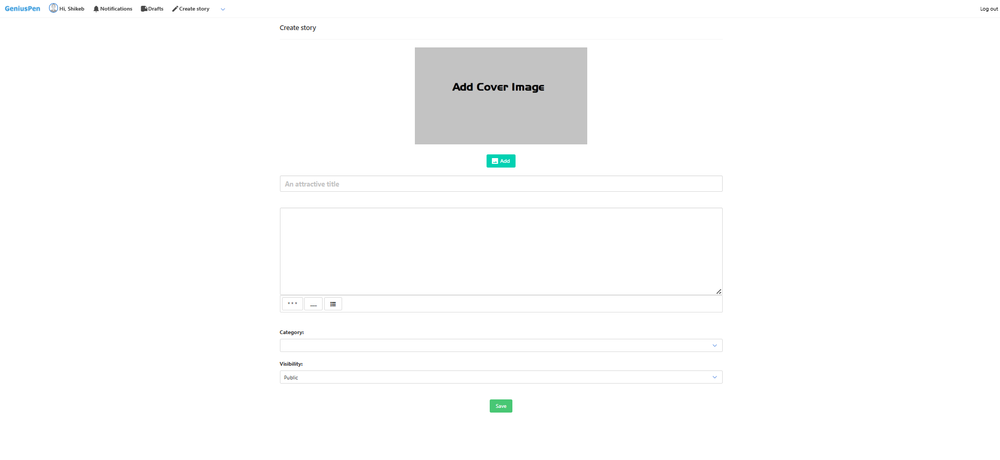

# ✒️ GeniusPen – A Django-Based Article Writing Platform

**GeniusPen** is a dynamic, open-source article-writing platform built with Django.  
It empowers writers to express their creativity, share insights, and connect with an engaged community through topic-driven content.

It’s lightweight, mobile-friendly, and perfect for both learning and showcasing your development skills in real-world scenarios.

---

## 🎯 The Mission

**GeniusPen** aims to provide a creative space for thinkers, learners, and storytellers.  
Whether you're writing about tech, lifestyle, health, or personal reflections — this platform helps you reach like-minded readers and build a following.

---

---

## 🚀 Features

- 📝 **Article Writing** – Easily create, edit, and publish articles on diverse topics.  
- 📖 **Read History** – Revisit recently viewed articles for better content tracking.  
- 📌 **Topic-Based Exploration** – Discover content by following topics you care about.  
- 💬 **Community Engagement** – Like, comment, and interact with articles and authors.  
- 🔗 **Follow System** – Build your audience and follow your favorite writers.  
- ✨ **Clean and Responsive UI** – Powered by Bulma CSS for a modern, mobile-ready experience.

---

## 📸 Screenshots

| Screenshot | Description |
|------------|-------------|
|  | Homepage with trending articles |
|  | Article View Page |
|  | Create New Article |
|  | Explore by Topic |
|  | User Profile |
|  | Read History Page |

> 📸 Make sure these image files exist in the `screenshots/` folder.

---

## 🛠 Tech Stack

- **Backend:** Django  
- **Frontend:** Bulma CSS, HTML, JavaScript  
- **Database:** SQLite (default), PostgreSQL (for production)  
- **Deployment:** Render / Heroku / Vercel (update as needed)  
- **Others:** Gunicorn, Whitenoise, dj-database-url

---

## ⚙️ Local Setup

```bash
git clone https://github.com/mshikebkhan/geniuspen.git
cd geniuspen
python -m venv venv
source venv/bin/activate  # On Windows: venv\Scripts\activate
pip install -r requirements.txt
python manage.py migrate
python manage.py createsuperuser
python manage.py runserver
```
---

## 👥 Contributing

1. Fork the repository
2. Create your feature branch: `git checkout -b feature-name`
3. Commit your changes
4. Push to your branch
5. Open a Pull Request 🚀

---

## 📌 TODO Ideas

- Customised user feed for the user based on their likes, saves, & Interests

---

## 📄 License

[MIT License](LICENSE)

---

Made with ❤️ by Shikeb Khan
